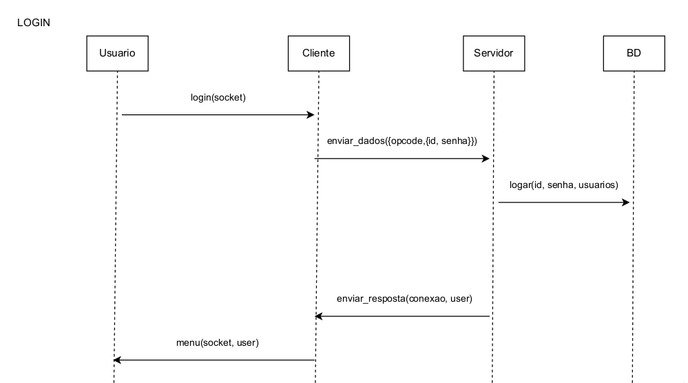
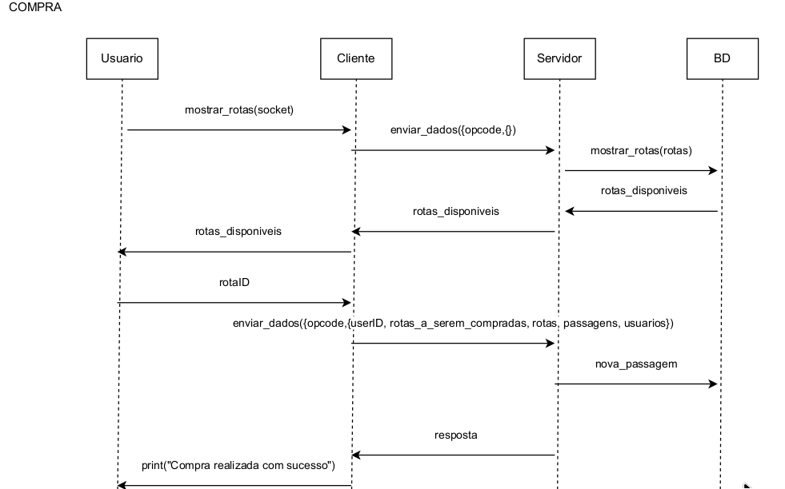
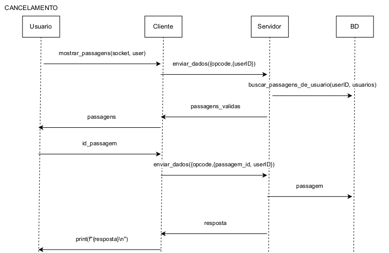

<h3 align="center">VendePass</h3>

 

 
<h2> Descrição do Projeto</h2>

O setor de aviação de baixo custo democratizou as viagens aéreas, desenvolvendo estratégias para obter um baixo custo em viagens que potencializam diversos setores da economia. Em resposta a essa importância, este software busca desenvolver uma forma de comunicação entre o cliente que busca sua passagem e o servidor da empresa aérea.

O protocolo de comunicação do projeto tem como base principal os subsistemas TCP/IP e tem como objetivo cumprir os seguintes requisitos:

* Comunicação Cliente/Servidor: Estabelecer a comunicação entre o cliente que busca e compra passagens e o servidor central da empresa aérea.

* Concorrência e prioridade: Garantir que o cliente que inicia o processo de compra de uma passagem tenha prioridade, não permitindo que outro cliente tenha posse do assento.

Dessa forma, é necessário realizar o controle minucioso de concorrência dentro da aplicação, além de garantir que não existam inconsistências durante a conexão.

<h2> Autores  </h2>
<uL>
  <li><a href="https://github.com/felipe-py">Felipe Silva</a></li>
  <li><a href="https://github.com/Lucas-L-Rodrigues">Lucas Lima</a></li>
</ul>

<h1 align="center"> Sumário </h1>

	<ul>
        <li><a href="#arquitetura"> Arquitetura do Projeto </a></li>
        <li><a href="concorrencia"> Concorrência e Escabilidade </a></li>
        <li><a href="#conclusao"> Considerações Finais </a></li>
        <li><a href="#execucaoProjeto"> Execução do Projeto Com Docker</a></li>
        <li><a href="#referencias"> Referências </a></li>
	</ul>	

<h2> Arquitetura do Projeto </h2>

Nesta seção, serão destacados os principais pontos que envolvem a arquitetura do software desenvolvido, o que engloba todas as funções e regras de negócio que estão relacionadas à comunicação entre o cliente e o servidor.

<h3> Comunicação entre Cliente e Servidor </h3>

Neste tópico, serão abordadas as questões relacionadas à conexão mantida entre cliente e servidor, abrangendo as responsabilidades de cada um e os protocolos e paradigmas utilizados.

<h4> Visão Geral e Protocolo de Comunicação</h4>

O projeto utiliza uma arquitetura de comunicação entre cliente e servidor baseada no sistema TCP/IP. As mensagens enviadas pela conexão estão em formato JSON, visando uma melhor estruturação e facilidade nos momentos de decodificação das requisições do cliente e respostas do servidor.

O papel principal do cliente é a solicitação das operações a serem realizadas pelo servidor. São elas: login no sistema, compra e cancelamento de passagens. Em relação ao servidor, este ficará responsável por processar as requisições e manipular os dados necessários em cada uma delas, retornando uma resposta adequada para cada situação.

O protocolo de comunicação de cada requisição, seja de forma direta (login, compra e cancelamento de passagens) ou indireta (visualizar rotas ou passagens) solicitada ao servidor, possuirá um opcode. Este opcode é responsável por identificar a operação que deve ser realizada pelo servidor, sendo 5 ao todo:

* opcode 1: Solicitação de login
* opcode 2: Solicitação para visualizar rotas disponíveis
* opcode 3: Solicitação para comprar passagens
* opcode 4: Solicitação para visualização de passagens compradas
* opcode 5: Solicitação para cancelar passagem comprada

Abaixo são apresentados os fluxogramas que representam a comunicação entre os agentes do sistema, abrangendo as situações de login, compra e cancelamento de passagens.

  

<strong> Figura 1. Diagrama de comunicação (Login) </strong>

  

<strong> Figura 2. Diagrama de comunicação (Compra de Passagem) </strong>

  

<strong> Figura 3. Diagrama de comunicação (Cancelamento de Passagem) </strong>

<h4> Comunicação no Cliente </h4>

No arquivo *cliente_threads.py*, temos acesso às funções do cliente que são utilizadas para a sua conexão e comunicação com o servidor, sendo elas: *conectar()*, *desconectar()* e *enviar_dados()*.

Na função *conectar()*, é criado um socket para estabelecer a conexão TCP/IP com o servidor. As funções *socket.AF_INET* e *socket.SOCK_STREAM* são utilizadas para gerar esse socket. Elas irão definir, respectivamente, o protocolo de comunicação como IPv4 e o uso do protocolo TCP para a comunicação.

O HOST (endereço IP) e PORT (número da porta que o servidor está escutando) são atribuídos ao cliente por meio da função *connect*. É importante salientar que a configuração é feita de forma que o cliente e o servidor utilizem a mesma porta e IP.

Para fechar a conexão, é utilizada a função close em *desconectar()*, o que é importante para que não haja nenhum cliente ocioso ocupando recursos operacionais do software, o que poderia ocasionar problemas de desempenho.

Em *enviar_dados()*, o dicionário em que são armazenadas as requisições enviadas pelo cliente é construído, contendo o opcode e os dados a serem manipulados pelo servidor, o que pode incluir credenciais de login, identificação de rotas, entre outros. Para enviar os dados ao servidor, o socket utiliza a função *sendall* juntamente com um *json.dumps*, que transforma o dicionário construído em JSON.

Os dados são então codificados em bytes e enviados de forma garantida devido ao uso da função *sendall*.

Para o recebimento da resposta enviada pelo servidor, é utilizada a função *recv(1024)* dentro de um loop. É importante o uso do loop while, pois os dados podem ser recebidos de forma fracionada. A junção da informação é feita e esta é novamente carregada em um dicionário.

<h4> Comunicação no Servidor </h4>

Em *servidor_threads.py* podemos encontrar as funções de comunicação do servidor: *main()*, *tratar_cliente()* e *enviar_resposta()*. Na *main()*, é feita a abertura do socket nos mesmos moldes explicados anteriormente na parte do cliente. Para garantir que o servidor seja reiniciado rapidamente, sem interferências do sistema operacional, é usada a função *setsockopt* com os parâmetros *SOL_SOCKET* e *SO_REUSEADDR*.

Para realizar o binding do socket do servidor a um IP e porta específicos, é utilizada a função *bind*. O endereço 0.0.0.0 é utilizado neste caso para garantir a aceitação de qualquer interface de rede.

Para cada novo cliente conectado ao servidor, é criada uma nova thread, e esse processo e sua motivação serão explicados posteriormente.

É necessário realizar a decodificação e tratamento das requisições enviadas pelo cliente, processo realizado em *tratar_cliente()*. A mensagem recebida em formato JSON é convertida para um dicionário, e o opcode extraído é alocado em condicionais que definirão o rumo de execução do servidor a partir da chamada de função pertinente a cada código recebido.

Para cada chamada feita, é retornada uma resposta, decodificada e enviada de volta ao cliente em *enviar_resposta()*. O processo de construção do JSON é realizado, e este é enviado em blocos de 1024 bytes controlados por um loop for.

O controle de envio da mensagem em um loop for é importante para evitar que o buffer exceda o tamanho máximo permitido de bytes, garantindo que a mensagem seja enviada corretamente ao cliente.

<h4> Paradigma de Comunicação </h4>

O stateful foi utilizado no projeto devido à necessidade de manter uma conexão contínua entre o cliente e servidor para a manutenção dos dados durante a sessão mantida entre eles. Os dados informados pelo cliente no login podem ser utilizados pelo servidor em quaisquer situações que envolvam a compra ou o cancelamento de uma passagem.

Isso se faz necessário para manter a identificação do cliente relacionada a esses processos no banco de dados do software. Ou seja, é feito o gerenciamento de um estado longo de interação, que pode ser modificado a qualquer momento durante a conexão por uma requisição.

<h3> Responsabilidades Gerais do Cliente e Servidor </h3>

Os arquivos *cliente_threads.py* e *servidor_threads.py* são também responsáveis respectivamente, pela exibição da interface ao cliente e lógica da aplicação. Funções de login e logout, compra e cancelamento de passagens, assim como os menus e inputs a serem visualizados pelo usuário estão presentes em *cliente_threads.py*.

Diversas regras são aplicadas para que não existam inconsistências durante os processos realizados pelo cliente, inicialmente durante o processo de login é permitido por exemplo que o usuário erre sua senha com um número ilimitado de tentativas, entretanto, ele poderá sair a qualquer momento por desistência.

Durante o processo de compra não são exibidos ao usuário trechos em que não existam assentos dispníveis para a viagem, importante salientar que esta informação é atualizada em tempo real para a confiabilidade do sistema durante multiplas conexões. Após cada ação realizada pelo cliente ser finalizada, este será redirecionado para o menu principal controlado por um loop.

Em *servidor_threads.py* as informações enviadas pelo usuário em cada uma das funções citadas acima serão decodificadas e manipularemos os dados necessários para executa-las corretamente. Tratamento de exceções são feitos para abertura do banco de dados, isso é realizado para que o sistema não trave em caso de uma falha na busca dos arquivos.

Todos os dados relacionados ao projeto são armazenados em arquivos do tipo JSON, estes são atualizados em tempo real pelo servidor através de funções de carregamento e atualização. Mensagens são exibidas no terminal de execução do servidor para garantir o correto funcionamento das funções a serem utilizadas.

<h2> Concorrência e Escabilidade </h2>

Estratégias foram desenvolvidas para lidar com as questões relacionadas à concorrência. A utilização de threads e mutex foi a principal delas. Nesta seção, essas escolhas serão explicadas, assim como sua relação com a escalabilidade do projeto como um todo.

<h4> Concorrência </h4>

As threads são utilizadas para o tratamento de conexões simultâneas, ou seja, cada vez que um cliente é inicializado e conectado ao servidor, ele será totalmente independente. Isso permite que o servidor atenda vários clientes ao mesmo tempo, sendo que estes podem realizar as mais diversas funções disponíveis.

A principal vantagem na utilização de threads neste projeto é a ausência da necessidade de espera de um cliente para realizar seu objetivo no sistema enquanto outro está sendo atendido. Isso evita bloqueios desnecessários na rotina dos clientes e não prejudica o desempenho de maneira significativa, devido ao baixo número de requisições que podem ser realizadas por vez.

Para prevenir uma condição de corrida na compra ou cancelamento de uma passagem, é utilizado um mutex. Isso garante que apenas uma thread tenha acesso a uma passagem específica, evitando que dois ou mais clientes comprem a mesma passagem ou que uma mesma passagem seja cancelada mais de uma vez.

<h4> Escalabilidade </h4>

Os principais pontos que prejudicam a escalabilidade do software estão relacionados à sua capacidade de suportar um grande número de clientes simultâneos, o que se deve principalmente à utilização de threads e à forma como o protocolo de comunicação é construído.

Cada thread consome um nível significativo de recursos, e essa dependência — onde cada cliente conectado resulta em uma nova thread — pode causar esgotamento de memória.

A utilização do JSON para armazenar os dados do sistema e como protocolo de comunicação é bastante simples. No entanto, essa abordagem se torna ineficiente quando milhares de clientes estão conectados e o servidor precisa manipular diversos dados ao mesmo tempo. Em casos de alta demanda, pode ocorrer lentidão no processamento dessas informações.

<h2> Considerações finais</h2>

De maneira geral, diversas estratégias apresentadas anteriormente foram utilizadas para otimizar o desempenho e trazer confiabilidade para a aplicação. Entretanto, elas podem se mostrar ineficientes principalmente em cenários de alta demanda.

A utilização de filas para distribuição das threads criadas poderia de certa forma reduzir os custos de carga do sistema, por outro lado, a fragmentação da mensagem no momento de envio de requisições e respostas por parte do servidor/cliente, diminui o risco de um congestionamento na rede.

O controle da concorrência no momento de compra da passagem é garantido devido a utilização do mutex, o que aumenta significativamente a confiabilidade do sistema. A durabilidade do sistema é garantida pela persistência dos dados em arquivo JSON, este pode ser alterado para um banco de dados mais robusto, o que melhoraria o tempo de resposta ao manipular várias informações para diversas requisições simultâneas.

<h2> Execução do Projeto Com Docker</h2>

A tecnologia do docker permitiu um grande encapsulamento de execuções graças a implementação de recursos como contêineres, com ela é possível de se encapsular não somente os arquivos a serem executados, mas também instalar suas dependências de forma automática. Na prática, temos nossa aplicação rodando em um compartimento autossuficiente e isolado, e isso ajuda muito na consistência da experiência ao usar o produto. Contudo o uso dessa tecnologia traz algumas limitações complicadas, pois se cada execução pode rodar em um ambiente quase independente, como fazer para conectar 2 ou mais containers? A solução para essa questão vem na forma de uma “network”.

<h3> Contêineres </h3>

Para criar o contêiner do servidor é necessário estar na pasta do aplicativo e então usar o seguinte comando:

*sudo docker build -t vende_pass_server -f Dockerfile_server .*

* Em que “sudo” garante privilégios de superusuário necessários para a execução;
* “docker build” invoca o comando para criar um contêiner no Docker;
* “-t vende_pass_server” aplica a tag, ou o identificador que será usado para se referir a esse contêiner no futuro, como vende_pass_server;
* “-f Dockerfile_server” indica que o arquivo que será usado para criar o contêiner é o Dockerfile_server;
* e por fim “.” indica que o arquivo que vai ser usado para fazer o contêiner está no atual diretório (A depender do seu “working directory” o argumento pode ser diferente).

De forma similar ao contêiner do servidor temos que o contêiner do cliente é feito com os mesmos argumentos:

 *sudo docker build -t vende_pass_cliente -f Dockerfile_cliente .*

Apenas vale ressaltar que o nome do contêiner deve ser diferente e o arquivo que será usado para criar o contêiner também é outro.

<h3> Network </h3>

Uma network é um conceito autoexplicativo, ela é uma rede que entrelaça containers permitindo que uma execução seja “visível” e possa se conectar a outra como numa rede de fato. No projeto em questão foi construída uma network(vende_pass_network) que envolverá os containers do servidor (vende_pass_server) e do cliente (vende_pass_cliente) permitindo que haja um comunicação estre eles. Para fazer uma network é usado o seguinte comando:

*sudo docker network create vende_pass_network*

O comando é similar ao usado na criação dos contêiners, tendo como óbvia diferença o “network create” que indica a criação da network e a não necessidade de um arquivo para sua criação ou, nesse caso, de modificadores. O comando apenas cria uma rede, mas não específica o que será feito nela afinal. Importante destacar que como a conexão entre os operadores estará sendo realizada pela rede do Docker a presença ou não de uma conexão ativa com a internet não é estritamente necessária, caso a mesma seja interrompida durante a execução das aplicações não haverá perdas.

<h3> Executando os contêineres na network </h3>
 
Para executar a aplicação é necessário que o contêiner do servidor na rede seja executado primeiro, afinal é com ele quee o cliente se comunicará, para isso é usado o seguinte comando:

*sudo docker run --rm --name servidor_container --network vende_pass_network -p 65432:65432 vende_pass_server*

* Em que “docker run” executa o contêiner;
* “—rm” é usado para garantir que depois da execução o contêiner não continuará rodando em segundo plano (importante uma vez que o servidor não deve ocupar o endereço de IP enquanto estiver desligado);
* “—name servidor_container” indica o nome personalizado para aquele contêiner em execução;
* “--network vende_pass_network” indica que ele deve rodar na rede vende_pass_network;
* “-p 65432:65432” mapeia a porta 65432 da máquina real para a porta do contêiner;
* e por fim “vende_pass_server” se refere a imagem que vai ser usada naquele contêiner.

De forma similar ao servidor a execução do cliente é realizada pelo seguinte comando:

*sudo docker run -it --rm --name cliente_container --network vende_pass_network vende_pass_cliente*

Em que a única grande diferença é o argumento “-it” que permite a utilização de um terminal de forma interativa pelo contêiner

  
<h2> Referências</h2>

RED HAT. Stateful vs. Stateless. Red Hat. Disponível em: https://www.redhat.com/en/topics/cloud-native-apps/stateful-vs-stateless. Acesso em: 23 set. 2024.

PYTHON SOFTWARE FOUNDATION. Biblioteca padrão do Python: Módulo socket. Python.org. Disponível em: https://docs.python.org/3/library/socket.html. Acesso em: 23 set. 2024.

HOSTINGER. O que é TCP/IP? Entenda o funcionamento e a importância. Hostinger. Disponível em: https://www.hostinger.com.br/tutoriais/tcp-ip. Acesso em: 23 set. 2024.

