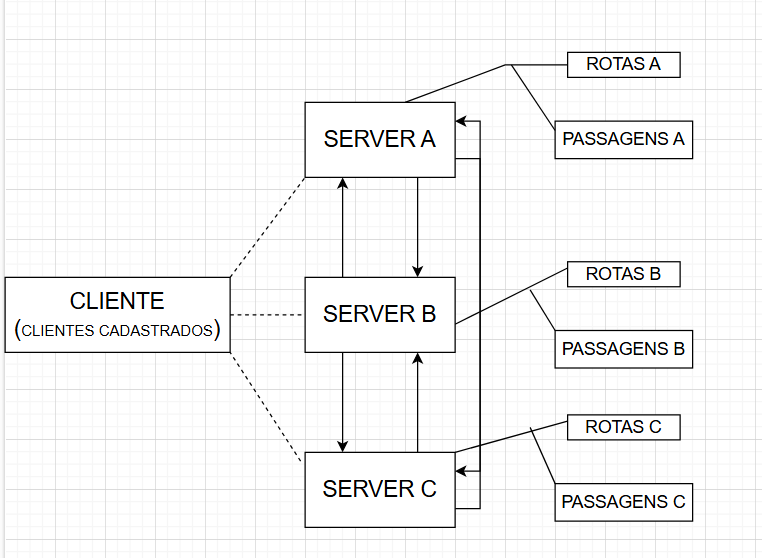
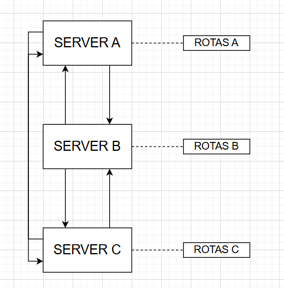
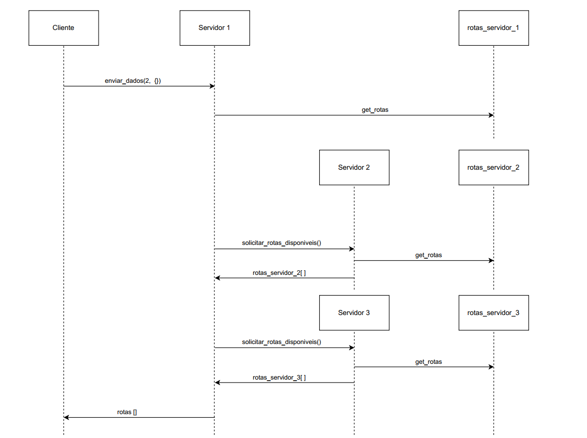

<h3 align="center">VendePass</h3>

 

 
<h2> Descrição do Projeto</h2>

Tomando como base o Projeto VendePass, que cria um sistema de relacionamento cliente/servidor para a compara de passagens aéreas. Desenvolveremos neste projeto um sistema que também tem como objeto a venda de passagens aéreas a baixo custo, entretanto desta vez teremos um compartilhamento destas funcionalidades para mais servidores.

Nesta aplicação, um cliente que deseja realizar a compra de uma passagem terá a sua disposição três empresas aéreas. Cada empresa aérea possuirá seu próprio servidor, porém, o cliente tem a opção de ao estar realizando a compra em um servidor A, ter acesso as passagens de B e C.

As funcionalidades devem estar em funcionamneto sem a necessidade de um servidor central para gerenciamento dos dados e operações das três empresas. Isso retira a dependência total que teríamos caso o servidor central estivesse em operação.

Para mais informações sobre o projeto VendePass, acesse: <li><a href="https://github.com/felipe-py/VendePass">VendePass Repositório</a></li>

<h2> Autores  </h2>
<uL>
  <li><a href="https://github.com/felipe-py">Felipe Silva</a></li>
  <li><a href="https://github.com/Lucas-L-Rodrigues">Lucas Lima</a></li>
</ul>

<h1 align="center"> Sumário </h1>

	<ul>
        <li><a href="#arquitetura"> Arquitetura da Solução </a></li>
        <li><a href="#protocolo"> Protocolo de Comunicação </a></li>
        <li><a href="#roteamento"> Roteamento </a></li>
        <li><a href="#concorrencia"> Concorrência Distribuída</a></li>
        <li><a href="#confiabilidade"> Confiabilidade da Solução </a></li>
        <li><a href="#docker"> Utilização do Docker </a></li>
        <li><a href="#conclusao"> Conclusão </a></li>
        <li><a href="#referencias"> Referências </a></li>
	</ul>	

<h2> Arquitetura da Solução </h2>

O diagrama que apresenta a arquitetura geral da solução pode ser visualizado na Figura 1, nele podem ser observadas a relaçao entre cliente, servidores e base de dados da aplicação.

  

<strong> Figura 1. Arquitetura Geral do Sistema </strong>

O cliente inicialmente terá a opção de se conectar a qualquer um dos três servidores, o servidor ao qual ele se conectar se tornará de certa maneira o servidor central para ele.

Este servidor em que foi feita a conexão, poderá realizar qualquer tipo de consulta ou ação que envolva os outros dois servidores. Esta dinêmica desenvolve um ambiente totalmente compartilhado, em que não se faz necessário a necessidade e dependência de utilizarmos um servidor central.

Cada servidor terá a sua própria base de dados de forma independente, englobando as informações relacionadas as suas rotas e passagens que foram vendidas. Além disso os dados que envolvem a relação de clientes cadastrados é comum a todos os servidores.

<h3> Conexão Cliente/Servidor </h3>

Para realizar a comunicação entre o cliente e o servidor "central" para as operações que serão realizadas, é utilizado um sistema semelhante ao desenvolvido no projeto VendePass com a utilização de threads.

Portanto, cada novo cliente conectado ao sistema será em tese uma nova thread ligada ao servidor em que foi solicitada a conexão.

<h3> Conexão entre Servidores </h3>

Cada servidor possuirá seu IP e porta próprios para uso das conexões, ou seja, para que um servidor seja conectado a outro caso necessário, serão necessárias somente estas duas informações.

Com relação ao carregamento dos dados de rotas, passagens e usuários cadastrados, cada servidor fará de maneira independente e somente se for solicitado.

<h2> Protocolo de Comunicação </h2>

[EM CONSTRUÇÃO (DEPENDENDO DE TESTES)]

<h2> Roteamento </h2>

A distribuição dos trechos em um servidor é feita de maneira semelhante ao que foi desenvolvido para o projeto VendePass, os trechos estão definidos de forma pronta, ou seja, não se faz necessária a pesquisa cidade origem/destino. Serão exibidos ao usuário somente os trechos com assentos disponíveis para a compra, sendo está regra vigente para os três servidores.

  

<strong> Figura 2. Roteamento de Rotas Entre Servidores </strong>

A relação de compartilhamento de rotas entre os servidores pode ser identificada na FIgura 2, nela podemos observar que os servidores podem se conectar entre si. Como cada servidor possui seu arquivo de armazenamento de trechos, devido ao compartilhamento entre servidores todos terão acesso aos trechos aéreos.

Devido a este compartilhamento, as funções de consulta e compra de trecho são comuns aos três servidores.

No diagrama apresentado na Figura 3 podemos realizar uma análise mais detalhada desta distribuição de trechos entre os servidores.

  

<strong> Figura 3. Compartilhamento de trechos entre servidores </strong>

<h2> Concorrência Distribuída </h2>

Para o controle da concorrência distribuída foi utilizado o algoritmo de Ricart-Agrawala, um protocolo de controle utilizado para coordenar o acesso de processos a um recurso compartilhado de um sistema distribuído.

Neste caso, o algoritmo foi utilizado para coordenar o acesso as passagens durante momentos críticos, como a compra.

<h3> Funcionamento </h3>

O processo de controle é iniciado na requisição, quando um servidor inicia o processo de compra é instaurada uma mensagem de requisição para os outros servidores. O processo funciona de forma temporal, um timestamp e um indicador de solicitação do acesso.

O próximo passo é o tratamento dessa requisição, é feita a verificação da marca temporal para análisar se a requisição pode ser atendida de forma imediata ou se deve haver um retardamento da resposta. O processo que solicitou o recurso só terá acesso a ele quando houver permissão de todos os outros processos em execução.

Com a permissão concedida o processo poderá entrar na região crítica de operação para compra da passagem, com a passagem comprada ela não estará disponível para compra no abnco de daods, finalizando o tratamento da requisição.

<h3> Vantagens e Limitações </h3>

O controle temporal feito pelo algoritmo garante o ordenamento das requisições, garantindo que não ocorra competição simultânea pelo mesmo recurso. Além disso, a troca de mensagens é feita de ponta a ponto, oq ue evita uma possível sobrecarga durante a comunicação.

Por se utilizar de características de controle temporais, em caso de ocorrência de muitas requisições simultâneas os processo terâo que aguardar por diversas repostas, ocasionando atrasos. A falha em um dos servidores, pode de certa forma ocasionar em falhas devido a dependência da resposta dos outros servidores para a liberação das requisições.

<h2> Confiabilidade da Solução </h2>

Nos tópicos que envolvem a confiabilidade da solução, podemos analisar de maneira mais abrangente aqueles que envolvem os processos críticos de compra e cancelamento de uma passagem.

Em ambos os casos o tratamento para uma situação de queda de um servidor é semelhante, caso esta situação venha a ocorrer o processo que esta ocorrendo no momento é cancelado. Por tanto, o cliente não conseguirá finalizar o seu carrinho de compras se nele estiver contida a passagem de um servidor em falha.

O memso ocorre para o processo de cancelamento, com relação a queda de um servidor antes do momentro de conexão inical do cliente, o servidor em falha não estrá disponível para login.

A concorrência distribuída pode não funcionar adequadamente caso a queda de um servidor aconteça, como temos um processo temporal cíclioco ocorrendo, existem chances de falha devido a não ocorrência de respostas pelo servidor falho.

<h2> Conclusão </h2>

O projeto cumpri os requisitos principais que envolvem uma aplicação de sistemas distribuídos, a comunicação entre cliente/servidor e entre servidores distintos é feita de maneira satisfatória.

Para tratamento da concorrência distribuída, um ponto de extrema importância quando estamos lidando com sistemas distribuídos, é utilizado o algoritmo de Ricart-Agrawala.Estes pontos de maneira geral satisfazem e resolvem os principais problemas que envolvem uma aplicação deste ramo.

<h2> Utilização do Docker </h2>

[EM CONSTRUÇÃO]

  
<h2> Referências</h2>

Ricart–Agrawala Algorithm in Mutual Exclusion in Distributed System. Disponível em: <https://www.geeksforgeeks.org/ricart-agrawala-algorithm-in-mutual-exclusion-in-distributed-system/>.

KIDD, C. Distributed Systems Explained. Disponível em: <https://www.splunk.com/en_us/blog/learn/distributed-systems.html>.

